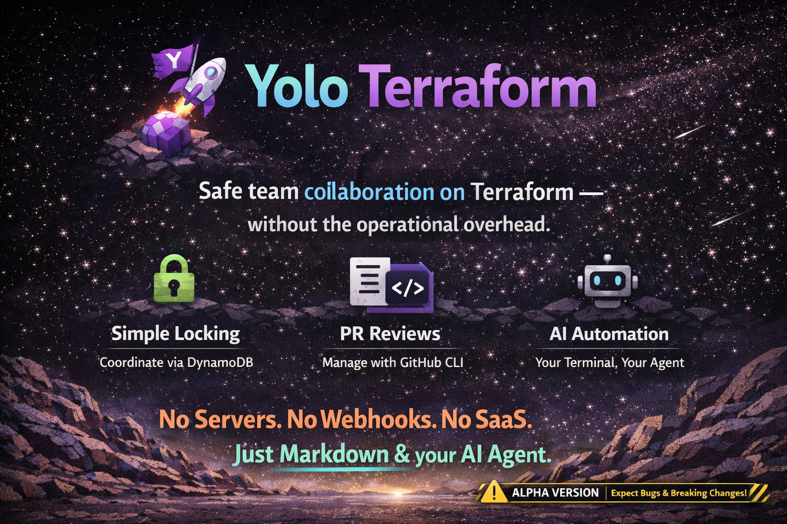

<p align="center">
  
  <br><br>
  <b>Collaborate on Terraform the lazy way —<br>your AI agent handles locking, plans, and PRs while you sip coffee.</b>
</p>

Teams need coordination when multiple people work on Terraform: locking to prevent conflicts, plan reviews on PRs, and an audit trail of applies. Tools like Atlantis, Spacelift, or Terraform Cloud solve this — but they come with servers to maintain, webhooks to configure, SaaS subscriptions, or complex CI pipelines.

Yolo Terraform gives you the same team workflows with radically less complexity. It's just markdown files that teach your AI coding agent how to run `terraform`, coordinate locks via a single DynamoDB table, and manage PRs via `gh` CLI. No server, no webhooks, no SaaS — just your terminal and your AI assistant.

> **Status: ALPHA** — Early-stage experiment. Expect rough edges and breaking changes. Contributions are very welcome! Some areas that would be fairly easy to add:
> - Alternative lock backends (e.g. Kubernetes ConfigMaps/Leases)
> - Support for other Git providers beyond GitHub (GitLab, Bitbucket, etc.)

## How It Works

```
Developer → AI Agent → terraform plan/apply
                    → DynamoDB lock management
                    → PR lifecycle via gh CLI
```

1. Invoke `/ytf` in your AI agent (Claude Code, Cursor, GitHub Copilot, etc.)
2. Agent detects which Terraform projects have changes (git diff vs main)
3. Acquires a DynamoDB lock to prevent concurrent operations
4. Runs `terraform init` + `plan`, shows output
5. You choose your workflow:
   - **Apply now** — apply immediately, no PR needed
   - **Review first** — create PR, get review, then apply
   - **Apply first** — create PR, apply immediately, get review after
6. Locks auto-clean when PRs are merged or closed

## Comparison

| Tool | Approach | Yolo Terraform Difference |
|---|---|---|
| **Atlantis** | Server + webhooks | No server to maintain |
| **Spacelift** | SaaS platform | No vendor lock-in, no subscription |
| **Terraform Cloud** | HashiCorp SaaS | No account needed, works with any backend |
| **env0** | SaaS platform | No third-party access to your infra |
| **Terragrunt** | CLI wrapper | Complementary — yolotf handles orchestration, not HCL |
| **CI/CD pipelines** | GitHub Actions, GitLab CI | No pipeline YAML to maintain, interactive workflow |

## What You Get

- **Project-level locking** — no concurrent plan/apply on the same stack (DynamoDB)
- **Plan output on PRs** — same team review workflow as Atlantis
- **Apply results on PRs** — full audit trail
- **Stale lock cleanup** — auto-releases locks from merged/closed PRs
- **Three workflow options** — apply-now, review-first, or apply-first
- **Multi-project support** — auto-detects affected projects from git changes
- **Works with any AI agent** — Claude Code, Cursor, GitHub Copilot

## Prerequisites

- `terraform`, `git`, `gh`, `aws` CLI installed
- AWS profile with Terraform plan/apply permissions
- AWS profile with DynamoDB access (can be the same profile)
- A DynamoDB table for locks (setup wizard creates it automatically if missing)

## Installation

One command per tool. Installs globally so skills are available across all your Terraform repos.

### Claude Code

```bash
npx skills add frank-bee/yolo-terraform -g -a claude-code
```

### Cursor

```bash
npx skills add frank-bee/yolo-terraform -g -a cursor
```

### GitHub Copilot

```bash
npx skills add frank-bee/yolo-terraform -g -a github-copilot
```

> Drop the `-g` flag to install per-repo instead of globally.

## Quick Start

1. **Run setup** (in your AI agent):
   ```
   /ytf:setup
   ```
   This verifies prerequisites, auto-discovers your Terraform projects, generates `.yolotf.yaml`, and creates the DynamoDB lock table if it doesn't exist.

2. **Start using it**:
   ```
   /ytf              # auto-detect changes and plan
   /ytf my-project   # plan a specific project
   /ytf:status       # see lock status
   /ytf:unlock       # release locks
   ```

## Commands

| Command | Description |
|---------|-------------|
| `/ytf [project]` | Plan/apply with locking and PR lifecycle |
| `/ytf:setup` | First-time setup and config generation |
| `/ytf:status` | Show projects, locks, PR states |
| `/ytf:unlock [project]` | Release project locks |
| `/ytf:help` | Show command reference |

## Configuration

Generated by `/ytf:setup` and stored in `.yolotf.yaml`:

```yaml
version: 1
user: jane
lockTTL: "168h"
terraform:
  profile: MyTerraformProfile
dynamodb:
  tableName: yolotf-locks
  region: us-east-1
  profile: MyDynamoDBProfile
projects:
  - name: app-dev
    dir: stacks/dev
  - name: app-prod
    dir: stacks/prod
```

## How Skills Work

Yolo Terraform is implemented entirely as **AI skill files** — structured markdown documents that teach AI coding agents how to execute Terraform workflows. There is no binary, no CLI tool, no runtime. The AI agent reads the skill files and executes the commands directly.

Supported tools:
- **Claude Code** (`~/.claude/skills/` or `.claude/skills/`)
- **Cursor** (`~/.cursor/skills/` or `.cursor/skills/`)
- **GitHub Copilot** (`~/.github/skills/` or `.github/skills/`)

## Repository Structure

```
skills/
  ytf/
    SKILL.md                       # Main orchestrator skill
    references/
      yolotf-reference.md          # DynamoDB ops, config schema, terraform execution
  ytf-setup/SKILL.md               # Setup wizard
  ytf-status/SKILL.md              # Status overview
  ytf-unlock/SKILL.md              # Lock release
  ytf-help/SKILL.md                # Command reference
```

## License

MIT
